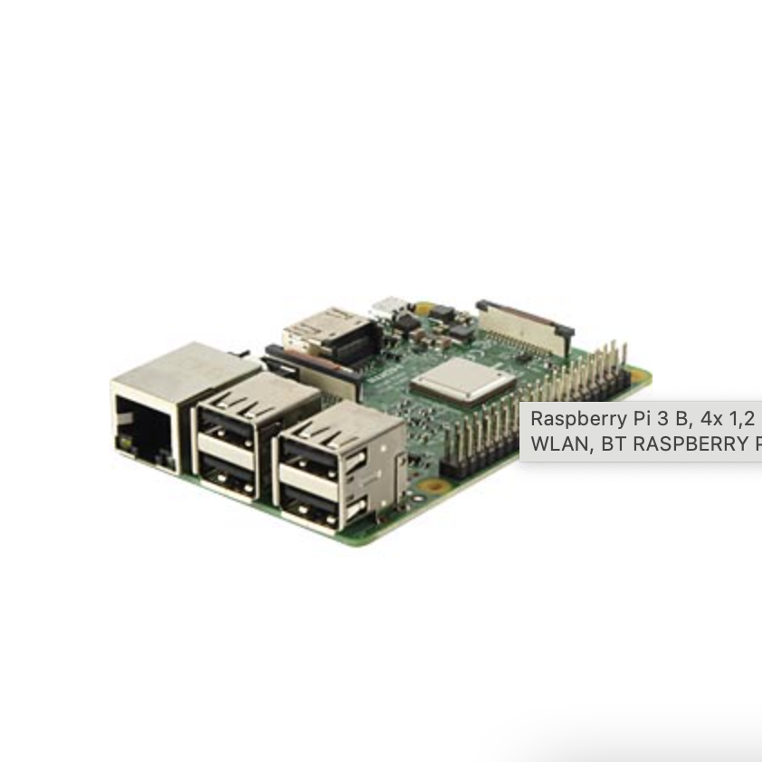
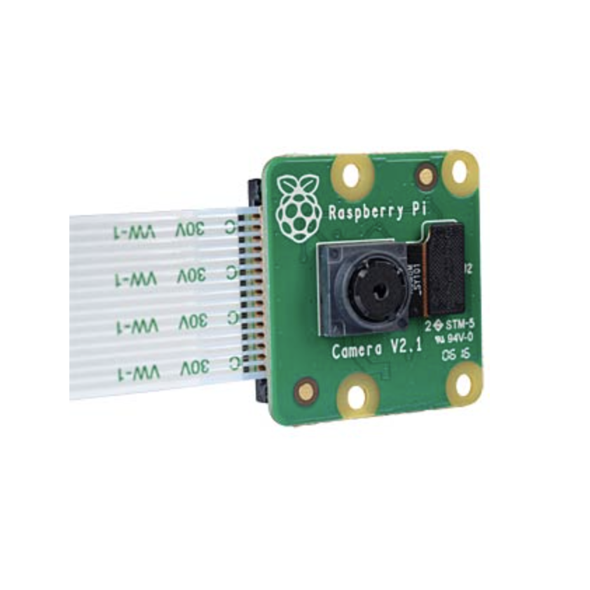
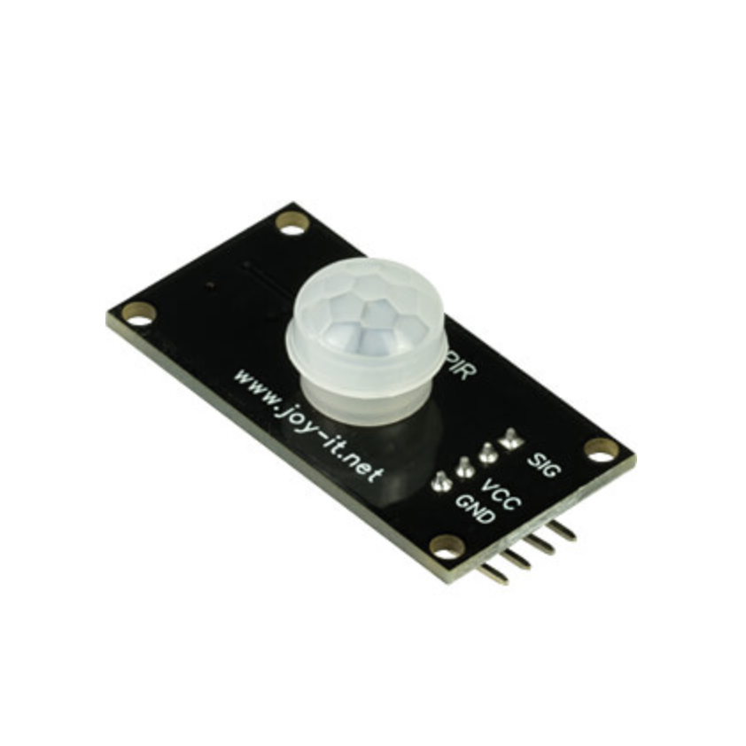
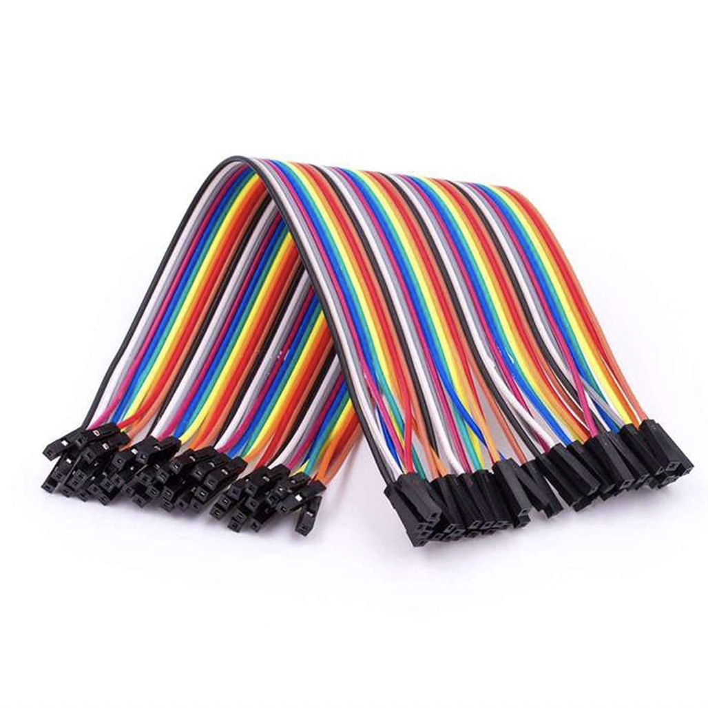

# BirdsOnBikes
## Setup
Raspberry Pi 4 + Camera Module V2

mit der Bibliothek [UV4L](https://raspberry-valley.azurewebsites.net/UV4L/), die ein einigermaßen flüssigen Videostream ermöglicht

Der Stream wird als Proxy-Server an stream.birdsh.it weitergeleitet

Der Streaming-Client befindet sich auf cam.yolobird.com

Auf dem Streaming-Client soll später auch di KI-Erkennung laufen. momentan wird dort jede Sekunde ein Standbild aus dem Stream gespeichert. Dieses Material könnte später auch genutzt werden um die KI weiter zu trainieren um später Vogelarten zu unterscheiden

mit folgendem Befehl kann das Script gestartet werden und wird auch nachdem sich der Benutzer vom Server abgemeldet hat, weiter ausgeführt

# Anleitung

## Die Komponenten

### RaspberryPi 3


### Raspberry Kamera V.2


### PIR Sensor (Bewegungssensor)


### 3x Kabel Weiblich/ Weiblich


## Zusammenbauen der Komponenten

    1. Den Gehäusedecke des Raspberry Pi´s abnehmen. 

    2. Das Kabel des Kamermoduls in den Beschrifteten Kamera Eingang stecken.
    (Hier auf die Richtung der Kontakte achten)

    3. Drei Kabel an die Pins (GND, VCC, SIG) des PIR Sensors anschließen. 

    4. Die Kabel müssen nun jeweils richtig an die Pins des Raspberry Pi´s angeschlossen werden. 
    GND = 6 / VCC = 4 / SIG = 16


## Installation

* Raspberry Pi OS Lite auf SD-Karte geflasht
* WLAN-Konfigurieren:
  * Speicherkarte in deinen Rechner einlegen
  * auf "boot" eine Datei mit dem Namen ``wpa_supplicant.conf`` anlegen
  * Datei im Editor öffnen und folgenden Code eingeben:
```bash ctrl_interface=DIR=/var/run/wpa_supplicant GROUP=netdev
country=de
update_config=1
network={
    ssid="<Name of your wireless LAN>"
    psk="<Password for your wireless LAN>"
}
```
* wpa_supplicant.conf und eine leere Datei mit dem Namen "ssh" auf die "boot"-Partition der Speicherkarte kopieren
* [Quelle](https://www.raspberrypi.org/documentation/configuration/wireless/headless.md)
* jetzt den Raspberry starten
* per SSH auf Raspberry zugreifen
* Die Reposity der Streaming Library UV4L hinzufügen
* `curl https://www.linux-projects.org/listing/uv4l_repo/lpkey.asc | sudo apt-key add -`
* `echo 'deb http://www.linux-projects.org/listing/uv4l_repo/raspbian/stretch stretch main' | sudo tee -a /etc/apt/sources.list`
* `sudo apt update`
* `sudo apt full-upgrade`
* Die benötigten Libraries installieren
* `sudo apt install python3-picamera python3-pip python3-gpiozero python3-pip uv4l uv4l-raspicam uv4l-raspicam-extras uv4l-webrtc`
* Kamera in raspi-config aktivieren
* (optional) den Hostname des Raspberry Pi
* git clone https://github.com/christian-busse/birdcam
* im Verzeichnis birdcam den folgenden Befehl ausführen:
``` bash
nohup python3 birdcam.py >output.log >error.log &
```
* jetzt kann man die SSH-Verbindung zum Raspberry mit ```exit``` wieder schließen
* um das Birdcam-Programm bei jedem Start auszuführen, bitte diese [Anleitung](https://learn.sparkfun.com/tutorials/how-to-run-a-raspberry-pi-program-on-startup/method-1-rclocal) befolgen
